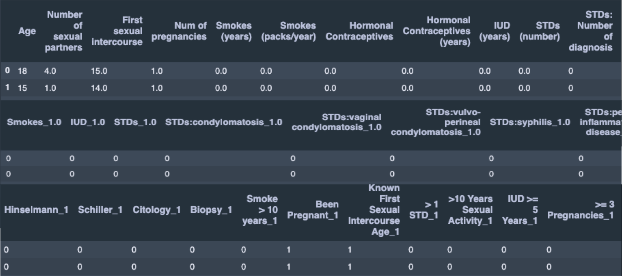
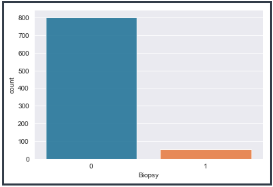
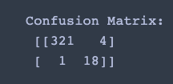

<h1>Flatiron School Mod 3 Project</h1>  
<h2>ML Project Aiming to Classify Cervical Cancer Biopsy Results</h2>

<h2>Intro</h2> 
In this project I used data collected from patients who were having biopsy tests done in order to detect whether cervical cancer was present. The features in the dataset dealt with age, past sexual experience and pregnancies, STD's, and smoking habits (if applicable). The target variable was biopsy result (0 for negative, 1 for positive).  

<h2>Goals for this Project</h2> 
<ul>
  <li>Use machine learning models to classify the correct biopsy result</li>
  <li>Obtain high F1 score on test data</li>
  <li><b>Reduce number of false negative cases in test data (Predicting negative biopsy result when in fact the biopsy came back positive)</b></li>
</ul>

<h2>Preview of Dataframe</h2> 
 
<ul>
  <li>Negative biopsy results: 803</li>
  <li>Positive biopsy results: 55</li>
  <li>Test train split: 60/40</li>
  <li>Training observations: 514</li>
  <li>Testing observations: 344</li>
</ul>

<h2>Class Imbalance</h2> 
  

To deal with this heavy class imbalance, I used SMOTE Oversampling techniques as well as Upsampling to even out the classes. Using both SMOTE and Upsampling allowed me to run models on each and compare which technique worked better for this dataset. Below I will highlight some of the models I ran using SMOTE, as SMOTE seemed to produce better results on this dataset.  

<h2>Classification Models Used</h2> 
<ul>
  <li>Logistic Regression</li>
  <li>Decision Tree</li>
  <li>Random Forest</li>
</ul>

<h2>Highlighting Model Results</h2> 
<ul>
  <li>Logistic Regression with SMOTE: 
    <ul>
      <li>Training F1: 0.8150765606595997<li>
      <li>Test Accuracy: 0.9127906976744186</li>
      <li>Test Precision: 0.36585365853658536</li>
      <li>Test Recall: 0.7894736842105263</li>
      <li>Test F1: 0.4999999999999999</li>
    </ul>
    This model is overfitting the training data!  
    
  <li>Decision Tree with SMOTE and Grid Search</li>
    <ul>
      <li>Best Paramaters: 'criterion': 'gini', 'max_depth': 2, 'max_leaf_nodes': 3, 'min_samples_leaf': 50</li>
      <li>Test Accuracy: 0.9302325581395349</li>
      <li>Test F1: 0.5384615384615385</li>
      <li>This model worked a little bit better than logistic regression but still left me with too many false negatives as          seen in the confusion matrix summary below:</li>
        <ul>
          <li>TN: 306</li>
          <li>TP: 14</li>
          <li>FP: 19</li>
          <li>FN: 5</li>
        </ul>
    </ul>
     
  <li>Random Forest with SMOTE and Grid Search (BEST MODEL)</li>
  <ul>
      <li>Best Paramaters: 'max_depth': None, 'max_features': 0.33,'min_samples_leaf': 2,'n_estimators': 100</li>
      <li>Test Accuracy: 0.9854651162790697</li>
      <li>Test F1: 0.8780487804878049</li>
      <li>This model worked the best out of all the models I ran and resulted in the lowest false negatives as seen in the confusion matrix below</li>
        ) 
This random forest model resulted in only 1 false negative and correctly classified 18/19 true positive cases. 
    </ul>
     
    
<h2>Going Forward</h2>
<ul>
  <li>Get more data (particulary more positive biopsy observations) so that I can expand both the training and test data. This will allow me to generalize the models better onto new unseen data.</li>
  <li>Run additional models on the data such as Adaboost and XGBoost.</li>
</ul>
